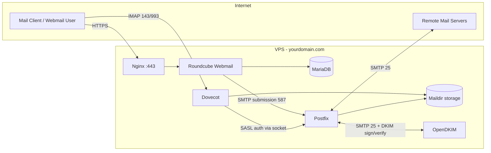

# linux-mail-server
Self-hosted Linux mail server (Postfix, Dovecot, DKIM/SPF/DMARC, TLS, Roundcube) built and documented from scratch on a VPS.


# Self-Hosted Linux Mail Server

A production-style mail server built from scratch on a Linux VPS, handling
inbound/outbound mail, authentication, TLS encryption, DKIM/SPF/DMARC signing,
and a web-based mail client — without relying on a managed email provider.

> **Note:** All domains, IP addresses, and credentials below are placeholders.
> Replace `yourdomain.com`, `YOUR_SERVER_IP`, and `CHANGE_ME` with your own
> values, and never commit real secrets to a public repository.

## What this project demonstrates

- Setting up and hardening an MTA (Mail Transfer Agent) and IMAP server from scratch
- Configuring SMTP authentication (SASL) between two independent services (Postfix + Dovecot)
- Issuing and wiring up TLS certificates for encrypted mail transport
- Implementing email authentication (SPF, DKIM, DMARC) to avoid landing in spam
- Reverse-proxying and serving a PHP webmail client (Roundcube) with Nginx + MariaDB
- Verifying every layer of the stack with real diagnostic tools (`telnet`, `openssl s_client`, `opendkim-testkey`, live test emails)

## Architecture



**DNS layer:** MX, SPF, DKIM (`TXT`), and DMARC (`TXT`) records tell the rest
of the internet that mail from this domain is legitimate and where to deliver
incoming mail.

## Tech stack

| Layer | Component |
|---|---|
| MTA (send/receive mail) | Postfix |
| Mailbox access (IMAP) | Dovecot |
| Email signing/verification | OpenDKIM |
| TLS certificates | Let's Encrypt / Certbot |
| Webmail client | Roundcube |
| Web server / reverse proxy | Nginx |
| Database | MariaDB |

---

## 1. DNS & hostname setup

The server's identity has to be consistent everywhere: the OS hostname, the
SMTP banner, and the DNS records all need to agree, or mail gets flagged or
bounced.

```bash
hostnamectl set-hostname mail.yourdomain.com
```

`/etc/hosts`:
```
YOUR_SERVER_IP   mail.yourdomain.com   mail
```

Verify local resolution:
```bash
ping mail
```

### DNS records to create at your DNS provider

| Type | Name | Content | Notes |
|---|---|---|---|
| A | yourdomain.com | `YOUR_SERVER_IP` | main domain |
| A | mail | `YOUR_SERVER_IP` | mail subdomain, **not** proxied (must resolve to the real IP for mail servers) |
| CNAME | www | yourdomain.com | |
| MX | yourdomain.com | mail.yourdomain.com | priority 10 |
| TXT | yourdomain.com | `v=spf1 mx ip4:YOUR_SERVER_IP -all` | SPF — declares which servers may send mail as this domain |
| TXT | _dmarc | `v=DMARC1; p=quarantine; rua=mailto:postmaster@yourdomain.com` | DMARC policy |
| TXT | mail._domainkey | *(generated in the DKIM step below)* | DKIM public key |

A **PTR record** (reverse DNS) also needs to be requested from your hosting
provider, pointing `YOUR_SERVER_IP` back to `mail.yourdomain.com`. Most spam
filters reject mail from IPs with no matching PTR record.

---

## 2. Postfix (SMTP server)

Postfix is the MTA: it receives, queues, and relays mail between servers over
SMTP, using DNS/MX records to find the right destination.

```bash
apt update && apt upgrade -y
apt install postfix -y
```

Postfix's queue directories, in `/var/spool/postfix`:

| Folder | Purpose |
|---|---|
| `active` | messages currently being delivered |
| `incoming` | received but not yet fully processed |
| `deferred` | delivery temporarily failed (DNS issue, remote server down, etc.) |
| `corrupt` | malformed message files |

### `/etc/postfix/main.cf` — core configuration

```ini
myhostname = mail.yourdomain.com
mydomain = yourdomain.com
myorigin = $mydomain

inet_interfaces = all
inet_protocols = ipv4

mydestination = $myhostname, localhost.$mydomain, localhost, $mydomain
home_mailbox = Maildir/

smtpd_banner = $myhostname ESMTP

mynetworks = 127.0.0.0/8
relay_domains =
smtpd_relay_restrictions = permit_mynetwork, permit_sasl_authenticated, reject_unauth_destination

smtpd_sasl_type = dovecot
smtpd_sasl_path = private/auth
smtpd_sasl_auth_enable = yes
smtpd_sasl_security_options = noanonymous
smtpd_sasl_local_domain =
broken_sasl_auth_clients = yes

alias_maps = hash:/etc/aliases
alias_database = hash:/etc/aliases

smtp_tls_security_level = may
smtp_tls_loglevel = 1
smtp_tls_session_cache_database = btree:${data_directory}/smtp_scache
```

Key design decisions worth calling out in an interview:

- **`myorigin = $mydomain`** — outgoing local mail is addressed as
  `user@yourdomain.com` rather than `user@mail.yourdomain.com`, matching
  standard convention (`mail.` is the server hostname, not part of the
  public email address).
- **`mynetworks` + `smtpd_relay_restrictions`** — this is the anti–open-relay
  configuration. Only `localhost` and authenticated (SASL) users are allowed
  to relay mail out; everyone else is rejected. Misconfiguring this is how
  servers get turned into spam relays.
- **`smtpd_sasl_path = private/auth`** — a Unix socket, inside Postfix's
  chroot, that bridges to Dovecot's authentication backend (see below).

### `/etc/postfix/master.cf` — service definitions

```
# service   type  private  unpriv  chroot  wakeup  maxproc  command
smtp        inet  n        -       y       -       -        smtpd

submission  inet  n        -       n       -       -        smtpd
  -o syslog_name=postfix/submission
  -o smtpd_tls_security_level=may
  -o smtpd_sasl_auth_enable=yes
  -o smtpd_recipient_restrictions=permit_sasl_authenticated,reject

submissions inet  n        -       y       -       -        smtpd
  -o syslog_name=postfix/submissions
  -o smtpd_tls_wrappermode=yes
  -o smtpd_sasl_auth_enable=yes
  -o smtpd_recipient_restrictions=permit_sasl_authenticated,reject
```

This exposes three SMTP entry points with different trust levels: port 25
for server-to-server relay (no auth, opportunistic TLS), port 587 for
authenticated client submission with STARTTLS, and port 465 for
authenticated client submission with implicit TLS from the start.

### Verifying Postfix

```bash
postfix check
systemctl start postfix
systemctl status postfix        # look for "active (running)"
ps aux | grep master            # confirm /usr/lib/postfix/sbin/master is running

ss -lntp | grep :25             # confirm Postfix is listening on 25
telnet localhost 25             # expect: 220 mail.yourdomain.com ESMTP
```

---

## 3. Protocol notes

| Protocol | Port(s) | Purpose |
|---|---|---|
| SMTP | 25, 587, 465 | sending mail (server↔server, or client submission) |
| POP3 | 110, 995 (TLS) | download-and-delete mailbox access |
| IMAP | 143, 993 (TLS) | server-side mailbox access, synced across devices |

- **Port 25** — server-to-server relay, usually unauthenticated, opportunistic `STARTTLS`.
- **Port 587** — client submission, `STARTTLS` negotiated after connecting.
- **Port 465** — client submission, TLS from the very first byte (implicit TLS).
- **SASL** (Simple Authentication and Security Layer) — how a client proves
  identity during the SMTP `EHLO` exchange (`AUTH PLAIN` / `AUTH LOGIN`).

---

## 4. Dovecot (IMAP + authentication backend)

Dovecot gives users IMAP/POP3 access to their mailbox, and doubles as the
SASL authentication backend Postfix delegates to.

```bash
apt update && apt upgrade -y
apt install dovecot-imapd -y
```

`/etc/dovecot/conf.d/10-mail.conf`:
```ini
mail_location = maildir:~/Maildir
```

`/etc/dovecot/conf.d/10-auth.conf`:
```ini
disable_plaintext_auth = yes
auth_mechanisms = plain login
```

`/etc/dovecot/conf.d/10-master.conf` — the socket Postfix connects to for SASL auth:
```ini
service auth {
  unix_listener /var/spool/postfix/private/auth {
    mode = 0660
    user = postfix
    group = postfix
  }
}
```

This socket lives inside Postfix's chroot jail, so Postfix can reach Dovecot
for authentication without being able to see the rest of the filesystem —
limiting the blast radius if Postfix itself is ever compromised.

```bash
systemctl restart dovecot
adduser amir
telnet localhost 143   # then: a login <user> <password>
```

---

## 5. TLS certificates (Let's Encrypt)

```bash
apt install certbot -y
certbot certonly --standalone -d mail.yourdomain.com
```

In `/etc/postfix/main.cf`:
```ini
smtpd_tls_cert_file = /etc/letsencrypt/live/mail.yourdomain.com/fullchain.pem
smtpd_tls_key_file  = /etc/letsencrypt/live/mail.yourdomain.com/privkey.pem
smtpd_use_tls = yes
smtpd_tls_security_level = may
```

In `/etc/dovecot/conf.d/10-ssl.conf`:
```ini
ssl = required
ssl_cert = </etc/letsencrypt/live/mail.yourdomain.com/fullchain.pem
ssl_key  = </etc/letsencrypt/live/mail.yourdomain.com/privkey.pem
```

Verify each encrypted port:
```bash
openssl s_client -connect mail.yourdomain.com:25  -starttls smtp
openssl s_client -connect mail.yourdomain.com:587 -starttls smtp
openssl s_client -connect mail.yourdomain.com:465
openssl s_client -connect mail.yourdomain.com:993
openssl s_client -connect mail.yourdomain.com:143
```

A separate certificate is issued for the web frontend (`yourdomain.com`) via
the Nginx plugin — see [Nginx & Roundcube](#7-nginx--roundcube-webmail).

---

## 6. DKIM (DomainKeys Identified Mail)

DKIM attaches a digital signature to outgoing mail using a private key; the
matching public key is published in DNS, so receiving servers can verify the
message wasn't altered in transit.

```bash
apt update
apt install opendkim opendkim-tools -y

mkdir -p /etc/opendkim/keys/yourdomain.com
chown -R opendkim:opendkim /etc/opendkim

cd /etc/opendkim/keys/yourdomain.com
opendkim-genkey -s mail -d yourdomain.com
chown opendkim:opendkim mail.private
chown opendkim:opendkim /etc/opendkim/keys/yourdomain.com/mail.txt
```

`mail.txt` gives you the DNS TXT record to publish (`mail._domainkey`).
**The private key (`mail.private`) never leaves the server or gets committed
anywhere.**

`/etc/opendkim.conf`:
```ini
Syslog           yes
UMask            002
Canonicalization relaxed/simple
Mode             sv
SubDomains       no
AutoRestart      yes
AutoRestartRate  10/1h
Background       yes
Socket           local:/run/opendkim/opendkim.sock
Selector         mail
Domain           yourdomain.com
KeyFile          /etc/opendkim/keys/yourdomain.com/mail.private
```

```bash
mkdir -p /run/opendkim
chown opendkim:opendkim /run/opendkim
systemctl restart opendkim
```

Wire it into Postfix (`/etc/postfix/main.cf`):
```ini
milter_default_action = accept
milter_protocol = 6
smtpd_milters = unix:/run/opendkim/opendkim.sock
non_smtpd_milters = unix:/run/opendkim/opendkim.sock
```

```bash
usermod -aG opendkim postfix
systemctl restart opendkim postfix
```

Verify:
```bash
dig mail._domainkey.yourdomain.com TXT +short
opendkim-testkey -d yourdomain.com -s mail -vvv   # expect: key OK
```

---

## 7. Nginx & Roundcube webmail

### Nginx reverse proxy + TLS

`/etc/nginx/sites-available/yourdomain.com`:
```nginx
server {
    listen 80;
    server_name yourdomain.com www.yourdomain.com;
    return 301 https://$host$request_uri;
}

server {
    listen 443 ssl http2;
    server_name yourdomain.com www.yourdomain.com;

    ssl_certificate     /etc/letsencrypt/live/yourdomain.com/fullchain.pem;
    ssl_certificate_key /etc/letsencrypt/live/yourdomain.com/privkey.pem;
    include /etc/letsencrypt/options-ssl-nginx.conf;
    ssl_dhparam /etc/letsencrypt/ssl-dhparams.pem;

    root  /usr/share/roundcube;
    index index.php index.html;

    location ~ \.php$ {
        include snippets/fastcgi-php.conf;
        fastcgi_pass unix:/run/php/php8.3-fpm.sock;
        fastcgi_param SCRIPT_FILENAME $document_root$fastcgi_script_name;
    }

    location / {
        try_files $uri $uri/ /index.php?$query_string;
    }
}
```

```bash
ln -s /etc/nginx/sites-available/yourdomain.com /etc/nginx/sites-enabled/
rm /etc/nginx/sites-enabled/default
nginx -t
systemctl restart nginx

apt install python3-certbot-nginx
certbot --nginx -d yourdomain.com -d www.yourdomain.com
```

### Roundcube + MariaDB

```bash
apt install roundcube roundcube-mysql php-fpm php-mysql php-intl \
            php-mbstring php-xml php-zip php-gd php-curl -y

apt install mariadb-server -y
systemctl enable --now mariadb
```

```sql
CREATE DATABASE roundcube CHARACTER SET utf8mb4 COLLATE utf8mb4_unicode_ci;
CREATE USER 'roundcube'@'localhost' IDENTIFIED BY 'CHANGE_ME_STRONG_PASSWORD';
GRANT ALL PRIVILEGES ON roundcube.* TO 'roundcube'@'localhost';
FLUSH PRIVILEGES;
```

```bash
mysql roundcube < /usr/share/roundcube/SQL/mysql.initial.sql
```

`/etc/roundcube/debian-db.php`:
```php
$dbuser   = 'roundcube';
$dbpass   = 'CHANGE_ME_STRONG_PASSWORD';   // use a secrets manager / env var in production
$basepath = '';
$dbname   = 'roundcube';
$dbserver = 'localhost';
$dbport   = '3306';
$dbtype   = 'mysql';
```

`/etc/roundcube/config.inc.php`:
```php
include("/etc/roundcube/debian-db-roundcube.php");

$config['imap_host']  = ["localhost:143"];
$config['smtp_host']  = 'tls://mail.yourdomain.com:587';
$config['smtp_user']  = '%u';   // logged-in user's own credentials
$config['smtp_pass']  = '%p';
$config['mail_domain'] = 'yourdomain.com';
$config['des_key']    = 'CHANGE_ME_RANDOM_24_CHAR_KEY';  // generate a fresh random value, never reuse
$config['skin']       = 'elastic';
$config['enable_spellcheck'] = false;
```

> **Secrets:** `$dbpass` and `$des_key` are real credentials. In a real
> deployment, pull them from environment variables or a secrets manager
> rather than committing them to version control — even privately.

---

## 8. End-to-end testing

```bash
# Manual SMTP handshake over STARTTLS
openssl s_client -connect mail.yourdomain.com:587 -starttls smtp
EHLO test
```

Expected response includes:
```
250-mail.yourdomain.com
250-PIPELINING
250-SIZE 10240000
250-AUTH PLAIN LOGIN
250-ENHANCEDSTATUSCODES
250-8BITMIME
250 CHUNKING
```

Queue management:
```bash
mailq          # list queued mail
postqueue -f   # force redelivery of queued mail
```

Live deliverability test — send a real message and inspect the received
headers for `DKIM=pass`, `SPF=pass`:
```bash
echo "DKIM test from my server" | mail -s "DKIM Test" -r "amir@yourdomain.com" you@gmail.com
```

---

## Security notes

- The private DKIM key (`mail.private`) and all real passwords/keys are
  **excluded** from this repository.
- `mynetworks` and `smtpd_relay_restrictions` are configured to prevent this
  server from being used as an open relay.
- `disable_plaintext_auth = yes` in Dovecot blocks credential submission over
  unencrypted connections.
- TLS is enforced on IMAP/POP3 (`ssl = required`) and available on every SMTP
  entry point.

## License

MIT
